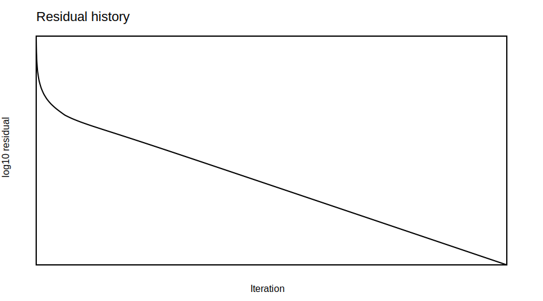

# Rust Heat Diffusion Solver

A compact Rust implementation of a 2D steady heat-diffusion solver for scientific-computing practice and thermal simulation workflows.

The project models a simple thermal problem: a hot chip region is placed in the centre of a rectangular domain, while the outer boundaries are kept cold. The temperature field is computed iteratively and the solver writes both numerical data and visual output files.

## Highlights

- Written in Rust with no external dependencies
- 2D structured grid: `80 x 50` cells
- Fixed-temperature cold boundaries: `300 K`
- Fixed-temperature hot chip region: `360 K`
- Jacobi-style iterative update
- Residual-based convergence check
- CSV export for numerical post-processing
- SVG export for visualising the temperature field and convergence history

## Motivation

This repository was built as a small scientific-computing project connecting Rust programming with heat transfer and numerical simulation. It is intentionally simple, readable, and easy to extend.

The idea is inspired by earlier MATLAB-based thermal modelling work for microprocessor cooling, but the implementation here is kept compact so that the numerical workflow is clear: define the grid, apply boundary conditions, iterate to convergence, save the results, and visualise the solution.

## Numerical model

The solver uses a simple neighbour-averaging update for the steady 2D heat-diffusion problem. For each interior cell that is not part of the hot chip region, the temperature is updated from the four neighbouring cells:

```text
T_new(i,j) = 0.25 * [T(i+1,j) + T(i-1,j) + T(i,j+1) + T(i,j-1)]
```

The iteration stops when the maximum temperature change per iteration drops below the specified tolerance.

Current solver settings:

```text
Grid size:                 80 x 50
Cold boundary temperature: 300 K
Hot chip temperature:      360 K
Maximum iterations:        30000
Convergence tolerance:     1.0e-6 K
```

## Results

The current simulation converged in `3701` iterations with a final residual of `9.988248e-7 K`. The computed temperature range is `300 K` to `360 K`.

| Quantity | Value |
|---|---:|
| Grid | 80 x 50 |
| Iterations completed | 3701 |
| Final residual | 9.988248e-7 K |
| Minimum temperature | 300.000 K |
| Maximum temperature | 360.000 K |

### Temperature field

The hot chip region is visible in the centre, with heat diffusing toward the cold boundaries.


### Convergence history

The residual plot shows the decrease in the maximum temperature update during the iterative solution.



## Output files

After a successful run, the program writes all results to the `results/` folder:

```text
results/temperature.csv
results/residuals.csv
results/summary.txt
results/temperature.svg
results/residuals.svg
```

The CSV files can be opened in Excel, Python, MATLAB, or any plotting tool. The SVG files can be opened directly in a browser and are displayed by GitHub.

## Project structure

```text
rust-heat-diffusion-solver/
├── Cargo.toml
├── README.md
├── LICENSE
├── docs/
│   └── method.md
├── results/
│   ├── temperature.csv
│   ├── residuals.csv
│   ├── summary.txt
│   ├── temperature.svg
│   └── residuals.svg
└── src/
    └── main.rs
```

## Run

Clone the repository and run:

```bash
cargo run --release
```

The program prints the convergence information in the terminal and updates the files in the `results/` folder.

## Run in GitHub Codespaces

GitHub Codespaces is a convenient way to run the project without setting up a full local Rust environment.

```bash
curl --proto '=https' --tlsv1.2 -sSf https://sh.rustup.rs | sh -s -- -y
source "$HOME/.cargo/env"
cargo run --release
```

## Run on Windows

After installing Rust with `rustup`, run:

```powershell
cargo run --release
```

If Rust reports that a linker is missing, install the Microsoft C++ Build Tools with the **Desktop development with C++** workload, then restart the terminal and run the command again.

## Scope and limitations

This is not a full CFD solver. It is a compact numerical-methods project intended to demonstrate a clean Rust implementation of a simple thermal simulation workflow.

Current simplifications:

- constant boundary temperatures,
- fixed hot chip region,
- no material-property variation,
- no convection term,
- no physical length scale or dimensional heat flux yet.

## Future improvements

- Add grid-independence comparison.
- Add material properties such as copper and aluminium.
- Add a bottom heat-flux boundary condition.
- Extend the model to convection-diffusion.
- Compare selected cases against the earlier MATLAB implementation.
- Add command-line parameters for grid size, temperatures, and tolerance.

## CV line

**Rust Heat Diffusion Solver — Rust, Numerical Methods, Scientific Computing**  
Implemented a compact 2D heat-diffusion solver in Rust with grid-based discretisation, iterative convergence monitoring, CSV export, and SVG visualisation of temperature and residual fields.
